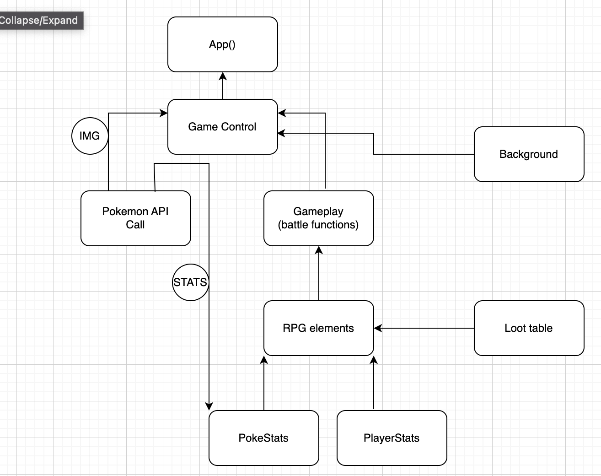

## Reaserch and Planning Log for Capstone

10:40 Thursday November 3rd: Created local environment for planning and research and GitHub Repo

10:44 - 11:00 creating Capstone Proposale.

11:00 am Google Search : creating a game in REACT

11:05 started 2048 Game in React - Animated Version - Game Development in React on Youtube(https://www.youtube.com/watch?v=ca0BEH2bBLs) to start understanding the process 1hr 8min
11:10 realized its for one game called 2048, not a sample of 2048 games done in REACT.

11:10 youtube search for "creating pokemon in react"
videos watched:
* Build A Pokémon Application With React - Tutorial https://www.youtube.com/watch?v=o3ZUc7zH8BE
Possibly install Axios in liue of using fetch for API calls. good video for API calls
* So Let's Make a Pokemon Game... https://www.youtube.com/watch?v=oQPun35o8uw 
this video is someone reacting to another video about a fan made pokemon game
* Let's Make a Pokemon Game! https://www.youtube.com/watch?v=tGhpDOx0CMk (for ideas)

---------------------------------------------------------

Friday November 4th

8:45 am
watching Pokémon JavaScript Game Tutorial with HTML Canvas https://www.youtube.com/watch?v=yP5DKzriqXA
itch.io for free game assets - overworld
download Tiled to build map
oof, this creater isnt using best practices in file creation
1024 x 576 pixels gives perfect 16:9 ratio

2pm- poked around for inspiration
https://reactjsexample.com/tag/games/

-----------------------------------------------------------
Nov 25th

3 pm watch more of https://www.youtube.com/watch?v=yP5DKzriqXA Pokémon JavaScript Game Tutorial with HTML Canvas

4:15 YouTube Search : can i make pokemon rpg in react

Building a Pokemon Web App - Pokemon API ReactJS https://www.youtube.com/watch?v=QFPSIT3ZR7Q

first video, used as a refresher to GET data from PokeAPI

Nov 26th

starting to build environment

